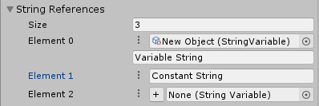

# ScriptableObject Variables

### What?

Check out Ryan Hipple's excellent Unite Austin 2017 [Presentation](https://youtu.be/raQ3iHhE_Kk?t=1057) for an idea of what ScriptableObject Variables are and how to make the best use of them.

# How to use?

#### 1. Start

>I've included several classes/structs to begin with, but you can easily create your own using generics:

```C#
[CreateAssetMenu
(fileName = "New"/*NAME*/,
menuName = "Hiralal/ScriptableObject Variables/_Basic Structs/"/*NAME*/)]  
public class /*NAME*/Variable : SOVariable</*NAME*/> { }
```
```C#
[Serializable]  
public class /*NAME*/Reference : SOVariableReference</*NAME*/>  
{   
  public /*NAME*/Reference() { }  
  public /*NAME*/Reference(/*NAME*/ value) : base(value) { }  
  
 [SerializeField] private /*NAME*/Variable Variable = null;  
 
 protected override SOVariable</*NAME*/> base_Variable => Variable;  
}
```

#### 2. That's All, Folks!

>Make full use of the UI.
>




# Created by Rohan.
### Thanks.